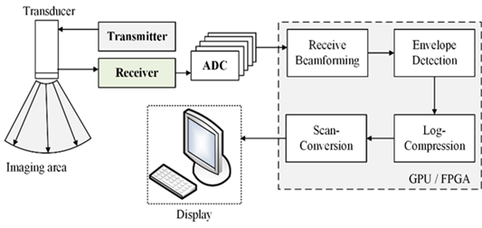
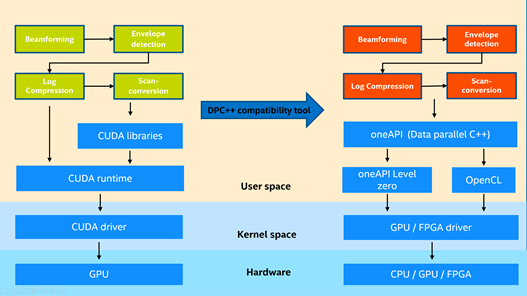
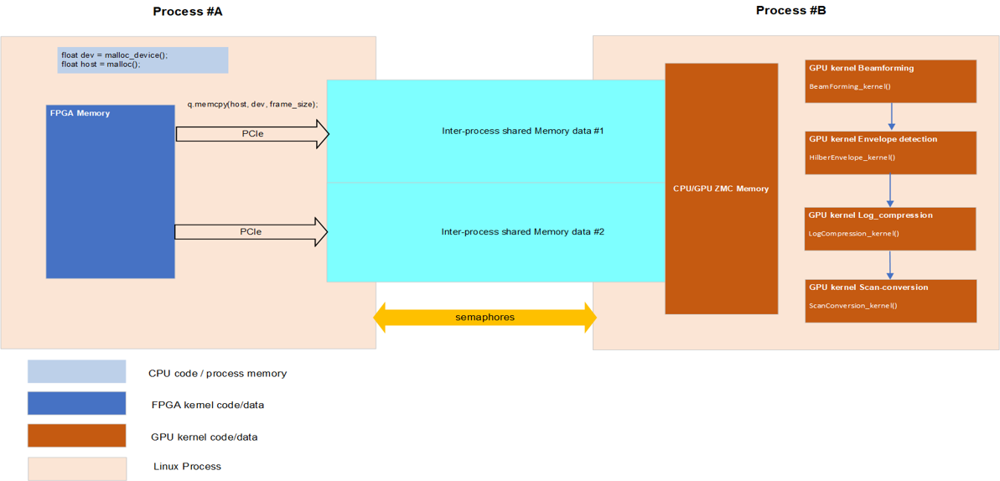
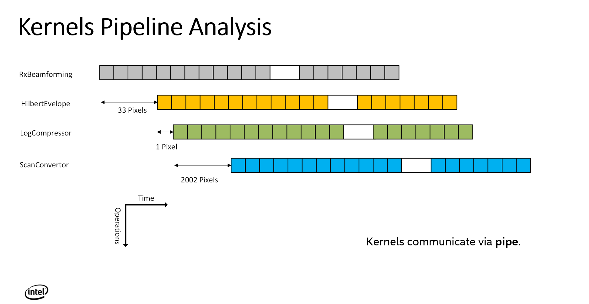

# oneAPI-Ultrasound-Beamforming-Library

This project contains 2 ultrasound software beamforming samples, which process ultrasound raw data into images human readable. The project use Intel oneAPI to do computation acceleration with Intel GPU and FPGA. 

This project is focusing on the kernel functions, including Receive Beamforming, Envelope Detection, Log Compression and Scan Conversion. The kernel functions are developed based on Supra(https://github.com/IFL-CAMP/supra). We have released a project for migrating origial Supra CUDA code to standard DPC++. For more details, please refer to: https://github.com/intel/supra-on-oneapi. 

The purpose of this project is for extracting and rewriting the kernel code for easily utilization and running on Intel xPU devices including GPU and FPGA.

## 1. Host Development System

The preferred (and tested) development host platform is PC with Ubuntu 18.04 & 20.04. The PC could have a graphics processor, a discrete graphics card, or an Intel FPGA. 

Intel CPU with Intel integrated and discrete GPU, and Intel FPGA as optional to be data producer. If FPGA is used to produce data for GPU, please install additional package for usage of FPGA. Please choose the version following your FPGA model type and refer to https://www.intel.com/content/www/us/en/developer/articles/release-notes/intel-oneapi-dpcpp-fpga-add-on-release-notes.html.

Also, Devcloud for OneAPI can be used for testing. Please refer to  https://devcloud.intel.com/oneapi.

This project has been tested on Intel® i7-8700K CPU with Intel(R) UHD Graphics 630 , please refer to https://ark.intel.com/content/www/us/en/ark/products/126684/intel-core-i7-8700k-processor-12m-cache-up-to-4-70-ghz.html.

This project has been tested on Intel® i7-1165G7 CPU with Intel® Iris® Xe Graphics, please refer to https://ark.intel.com/content/www/us/en/ark/products/208662/intel-core-i71165g7-processor-12m-cache-up-to-4-70-ghz.html.

This project has been tested on Intel® Programmable Acceleration Card with Intel Arria® 10 GX FPGA, please refer to https://www.intel.com/content/www/us/en/products/details/fpga/platforms/pac/arria-10-gx.html.

### (1) Install Basic Packages

    $ sudo apt-get install cmake cmake-gui libtbb-dev git build-essential clang

### (2) Install Intel oneAPI Toolkits

Please refer to Intel(R) oneAPI installation guide: https://software.intel.com/content/www/us/en/develop/articles/installation-guide-for-intel-oneapi-toolkits.html. 

Choose the version following your FPGA model type to add FPGA additional package, and refer to https://www.intel.com/content/www/us/en/developer/articles/release-notes/intel-oneapi-dpcpp-fpga-add-on-release-notes.html. 

## 2. oneAPI Ultrasound Beamforming Library Setup

### (1) Get oneAPI Ultrasound Beamforming Library Source Code

Download the source code from GitHub.

    $ git clone https://github.com/intel/ oneAPI-Ultrasound-Beamforming-Library.git

### (2) Initialize oneAPI Environment

After downloading source code, we could start compile it. Initialize one API environment:

    $ source <oneapi root dir>/setvars.sh

Default:

    $ source /opt/intel/inteloneapi/setvars.sh

## 3. GPU lib code

In real application scenarios, FPGA is often used to connect the ultrasound probe to collect data. So we simulated using FPGA as a data producer to provide data for GPU. Of course, a simple application is also provided to test software beamforming on the GPU. We have tested and valided data producer on Intel® Programmable Acceleration Card with Intel Arria® 10 GX FPGA.

### (1) Build

Enter the project folder.

    $ cd oneAPI-Ultrasound-Beamforming-Library/gpu

Create a directory `build` at the `gpu` directory:

    $ mkdir build

    $ cd build

In this repo, we just call the oneAPI feature to avoid moving data back and forth between host and device as ZMC(Zero memory copy, just an abbreviation to describe the feature in this repo). The detail of the feature could be found in https://www.intel.com/content/www/us/en/develop/documentation/oneapi-gpu-optimization-guide/top/memory/host-device-memory.html. And the feature is only used for Intel integrated GPU. If you want to test the GPU performance for easy testing, and using ZMC feature is selected to use or not (which is set to use ZMC by default), run cmake using the command:

    $ cmake .. -DUSE_ZMC=ON/OFF

Then run make using the command:

    $ make -j4

If you want to compile FPGA binary or using FPGA emulator to emulate data producer to send data, run `cmake` using the command:

    $ cmake .. -DUSE_ZMC=ON/OFF -DCOMPILE_FPGA=ON

then run make using the command if a new FPGA binary is needed to be compiled:

    $ make fpga -j4

If you want to use FPGA emulator, use the command:

    $ make fpga_emu -j4

Note: ZMC feature can be only used with Intel integrated GPU. Please switch USE_ZMC = OFF if using Intel discrete graphics card.

### (2) Run the program

Download data to `build` directory.

    $ mkdir data
    $ cd data
    $ wget https://f000.backblazeb2.com/file/supra-sample-data/mockData_linearProbe.zip
    $ unzip mockData_linearProbe.zip
    $ cd ..

If just test the GPU performance for easy testing, run the command:

    $ src/easy_app data/linearProbe_IPCAI_128-2.mock data/linearProbe_IPCAI_128-2_0.raw

Note: (if you run it on Intel discrete GPU, you need to run `export GC_EnableDPEmulation=1` before running above command)

If you compile an FPGA emulator version to test, run the command:

    $ src/ultrasound data/linearProbe_IPCAI_128-2.mock data/linearProbe_IPCAI_128-2_0.raw

If you compile an FPGA hardware version to test, run the command:

    $ src/fpga_producer.fpga data/linearProbe_IPCAI_128-2.mock data/linearProbe_IPCAI_128-2_0.raw

And for the comsumer app, use the command in another terminal:

    $ src/ultrasound data/linearProbe_IPCAI_128-2.mock data/linearProbe_IPCAI_128-2_0.raw

### (3) See the result and performance

Comsuming time of each kernel's calculation could be seen in the terminal.
Visual `*.png` results are stored in current directory.

## 4. FPGA standalone lib code

FPGA standalone lib code has been tested and valided on Intel® Programmable Acceleration Card with Intel Arria® 10 GX FPGA.
### (1) Build

Enter the project folder.

    $ cd oneAPI-Ultrasound-Beamforming-Library/fpga/standalone

Create a directory `build` at the `standalone` directory:

    $ mkdir build
    $ cd build

To compile for the Intel® PAC with Intel Arria® 10 GX FPGA, run cmake using the command :

    $ cmake ..

Alternatively, to compile for the Intel® FPGA PAC D5005 (with Intel Stratix® 10 SX), run cmake using the command:

    cmake .. -DFPGA_BOARD=intel_s10sx_pac:pac_s10

You can also compile for a custom FPGA platform. Ensure that the board support package is installed on your system. Then run cmake using the command:

    $ cmake .. -DFPGA_BOARD=<board-support-package>:<board-variant>

Compile the design through the generated `Makefile`. The following build targets are provided, matching the recommended development flow:

Compile for emulation (compiles quickly, targets emulated FPGA device):

    $ make emu

Generate the optimization report:

    $ make report

Compile for FPGA hardware (takes longer to compile, targets FPGA device):

    $ make fpga

### (2) Run the program

Download data to `build` directory.

    $ mkdir data
    $ cd data
    $ wget https://f000.backblazeb2.com/file/supra-sample-data/mockData_linearProbe.zip
    $ unzip mockData_linearProbe.zip
    $ cd ..

If you compile an FPGA emulator version to test, run the command:

    $ ./ultrasound.fpga_emu data/linearProbe_IPCAI_128-2.mock data/linearProbe_IPCAI_128-2_0.raw

If you compile an FPGA hardware version to test, run the command:

    $ ./ultrasound.fpga data/linearProbe_IPCAI_128-2.mock data/linearProbe_IPCAI_128-2_0.raw

### (3) See the result and performance

Comsuming time of each kernel's calculation could be seen in the terminal.
Visual `*.png` results are stored in current directory.

## 5. FPGA pipeline lib code

FPGA standalone lib code has been tested and valided on Intel® Programmable Acceleration Card with Intel Arria® 10 GX FPGA. Pipelining the kernels can improve the efficiency and performance of the beamforming algorithm on FPGAs. You can refer to the link to learn more about oneAPI dpcpp optimization on Intel FPGA. https://software.intel.com/content/dam/develop/external/us/en/documents/oneapi-dpcpp-fpga-optimization-guide.pdf

### (1) Build

Enter the project folder.

    $ cd oneAPI-Ultrasound-Beamforming-Library/fpga/pipeline

Create a directory `build` at the `pipeline` directory:

    $ mkdir build
    $ cd build

To compile for the Intel® PAC with Intel Arria® 10 GX FPGA, run cmake using the command. If you want to store the results of each kernel(storing by default and you can choose not to set this option).

    $ cmake .. -DSTORE=ON

Or

    $ cmake .. -DSTORE=OFF

Alternatively, to compile for the Intel® FPGA PAC D5005 (with Intel Stratix® 10 SX), run cmake using the command:

    $ cmake .. -DFPGA_BOARD=intel_s10sx_pac:pac_s10 -DSTORE=ON/OFF

You can also compile for a custom FPGA platform. Ensure that the board support package is installed on your system. Then run cmake using the command:

    $ cmake .. -DFPGA_BOARD=<board-support-package>:<board-variant> -DSTORE=ON/OFF

You can choose `FAKEDATA` building option `on/off` to valid the performance without DDR bandwith limit. By default, the program will use real raw data to do calculations. If set `-DFAKEDATA=ON`, there will not be DDR bandwidth limit to decrease the throughput of the pipelined program and fake input data will be used. So if using `FAKEDATA`, run `cmake` using the command:

    $ cmake .. -DFAKEDATA=ON -DSTORE=OFF/ON

Compile the design through the generated `Makefile`. The following build targets are provided, matching the recommended development flow:

Compile for emulation (compiles quickly, targets emulated FPGA device):

    $ make emu

Generate the optimization report:

    $ make report

Compile for FPGA hardware (takes longer to compile, targets FPGA device):

    $ make fpga

### (2) Run the program

Download data to `build` directory.

    $ mkdir data

    $ cd data

    $ wget https://f000.backblazeb2.com/file/supra-sample-data/mockData_linearProbe.zip

    $ unzip mockData_linearProbe.zip

    $ cd ..

If you compile an FPGA emulator version to test, run the command:

    $ ./ultrasound.fpga_emu data/linearProbe_IPCAI_128-2.mock data/linearProbe_IPCAI_128-2_0.raw

If you compile an FPGA hardware version to test, run the command:

    $ ./ultrasound.fpga data/linearProbe_IPCAI_128-2.mock data/linearProbe_IPCAI_128-2_0.raw

### (3) See the result and performance

Comsuming time of each kernel's calculation could be seen in the terminal.
Visual `*.png` results are stored in current directory.
