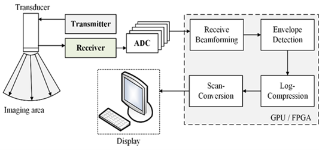
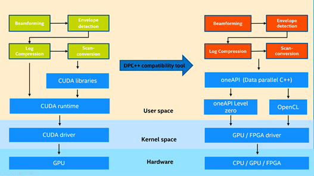
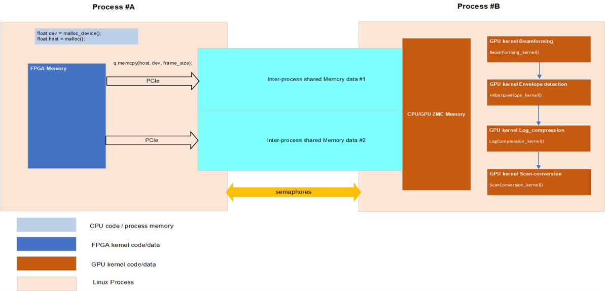

# oneAPI-Ultrasound-Beamforming-Library

This project contains ultrasound software beamforming samples, which process ultrasound raw data into images human readable. The project use Intel oneAPI to do computation acceleration with Intel integrated GPU. 



This project is focusing on the kernel functions of the workflow of ultrasound beamforming process, including Receive Beamforming, Envelope Detection, Log Compression and Scan Conversion. The kernel functions are developed and rewritten based on Supra(https://github.com/IFL-CAMP/supra). We have released a project for migrating origial Supra CUDA code to standard DPC++. For more details, please refer to: https://github.com/intel/supra-on-oneapi. 



The purpose of this project is for extracting and rewriting the kernel code for easy utilization and running on Intel integrated GPU.

## 1. Host Development System

The preferred (and tested) development host platform is PC with Windows 11 24H2. The PC could have an Intel processor with integrated graphics. Also you could test the project on Intel Devcloud.

### (1) Run with Devcloud

The Intel DevCloud is a development sandbox to learn about and test programming cross architecture applications with OpenVino, High Level Design (HLD) tools – oneAPI, OpenCL, HLS – and RTL. Devcloud for OneAPI can be used for running and testing this project and you could choose to use Intel integrated GPU. Please refer to  https://devcloud.intel.com/oneapi to view the details of how to use Devcloud.

### (2) Set up your own development system

If you have your own Intel acceleration devices including Intel CPU with integrated GPU. Run the project on your own development machine is an option.

This project provides 1 samples to test software beamforming. It is for Intel integrated GPU. You could choose to run the kernels one by one or make them pipelined to reach better performance.

|  Sample  | Acceleration Device  |
|  ----  | ----  |
| 1st  | Intel® Core™ Ultra 7 Processor 255H with Intel® Arc™ 140T |
|  | Intel® Core™ Ultra 5 Processor 125H with Intel® Arc™ graphics |

#### (a) Install Basic Packages

Please install visual studio 2022, this is the reference link:
```
https://visualstudio.microsoft.com/downloads/
```
Must Installed:

Workloads: 

```
Desktop development with C++
```

Individual components:

```
MSVC v143 – VS 2022 C++ x64/x86 build tools(Latest)
C++ CMake tools for Windows, Windows 11 SDK
```

Optional installed:

Individual components:

```
C++ Clang Compiler for Windows
MSBuild support for LLVM(clang-cl) toolset
```

#### (b) Install Intel oneAPI Toolkits

Please refer to Intel(R) oneAPI installation guide: https://software.intel.com/content/www/us/en/develop/articles/installation-guide-for-intel-oneapi-toolkits.html. 

## 2. oneAPI Ultrasound Beamforming Library Setup

### (1) Get oneAPI Ultrasound Beamforming Library Source Code

Download the source code from GitHub.

    $ git clone https://github.com/intel/ oneAPI-Ultrasound-Beamforming-Library.git

### (2) Initialize oneAPI Environment

After source code download, and patches applied, let’s start compile it.

Initialize one API environment:

Press Win key and enter oneAPI, select the
```
Intel oneAPI command prompt for intel 64 for Visual Studio 2022
```
and click
```
Run as administrator
```
After click Yes, you can see the follow window:

```
:: initializing oneAPI environment...
   Initializing Visual Studio command-line environment...
   Visual Studio version 17.14.19 environment configured.
   "C:\Program Files\Microsoft Visual Studio\<version>\"
   Visual Studio command-line environment initialized for: 'x64'
:  advisor -- latest
:  compiler -- latest
:  dal -- latest
:  dev-utilities -- latest
:  dnnl -- latest
:  dpcpp-ct -- latest
:  dpl -- latest
:  ipp -- latest
:  ippcp -- latest
:  mkl -- latest
:  ocloc -- latest
:  tbb -- latest
:  umf -- latest
:  vtune -- latest
:: oneAPI environment initialized ::
```

## 3. Ultrasound Beamforming on Intel GPU

### (1) Build

Enter the project folder.
```
    $ cd oneAPI-Ultrasound-Beamforming-Library/gpu
```
Create a directory `build` at the `gpu` directory:
```
    $ mkdir build

    $ cd build
```
In this repo, we just call the oneAPI feature to avoid moving data back and forth between host and device as ZMC(Zero memory copy, just an abbreviation to describe the feature in this repo). The detail of the feature could be found in https://www.intel.com/content/www/us/en/develop/documentation/oneapi-gpu-optimization-guide/top/memory/host-device-memory.html. And the feature is only used for Intel integrated GPU to make no memory copy operation between host and Intel integrated GPU. If you want to test the GPU performance, select whether to use ZMC feature (set to use ZMC by default), run cmake using the command:
```
    $ cmake -G "NMake Makefiles" -DUSE_ZMC=ON/OFF -DCMAKE_BUILD_TYPE=Release ..
```
Then run make using the command:
```
    $ nmake
```
Note: ZMC feature can be only used with Intel integrated GPU.


### (2) Run the program

Download data to `build` directory.
```
    $ mkdir data
    $ cd data
    $ wget https://f000.backblazeb2.com/file/supra-sample-data/mockData_linearProbe.zip
    $ unzip mockData_linearProbe.zip
    $ cd ..
```
If just test the GPU performance for easy testing, run the command:
```
    $ easy_app.exe data/linearProbe_IPCAI_128-2.mock data/linearProbe_IPCAI_128-2_0.raw
```

### (3) See the result and performance

Comsuming time of each kernel's calculation could be seen in the terminal.
Visual `*.png` results are stored in `res` directory. You could also specify the directory to store result by running the command:
```
    $ easy_app.exe data/linearProbe_IPCAI_128-2.mock data/linearProbe_IPCAI_128-2_0.raw <directory to store results>
```